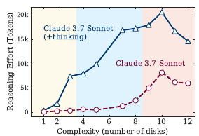

# The Illusion of Thinking

## GPT prompts
None

## Questions

1) **What did the authors try to accomplish?**  
They tried to investigate if reasoning models (LRMs) actually offer advantages over simple LLMs that lack the capability to reason.
In particular, they argue that current evaluation of reasoning models is hard because it is not clear whether their improved performance comes from: data contamination, using more tokens. or actually from being training on reasing via RL.

2) **What were key elements of the approach?**  
- They designed an controllable environment for testing LRMs vs. LLMs: a puzzle environment in which complexity of the task can easily be adjusted  
- that way they assure no data contamination  
- with this setup they can track intermediate steps of solving the puzzle (the RLM will output these) allowing to investigate reasoning paths  
- evaluated frontier models like Claude Sonnet and DeepSeek (+o3)  

3) **What can you use for yourself?**  
- it is a good idea to try to create controllable benchmark datasets that allow better evaluation of LLMs  
- **researchers even from established institutions sometimes miss details**  
- it was very intersting to read this paper and then the follow up comment from anthropic 

4) **What other references can you follow?**  

## Handwritten notes

- in reasoning models there seems to be a limit on how useful reasoning traces are depending on problem complexity  
- for easy problems LRMs offer not advantage over LLMs  
- for medium problems LRMS perform better than LLMs  
- for hard problems LRMs as well as LLMs reach a complexity treshold and crash out (near-zero accuracy)  
- they tested on puzzle problems, for example tower of hanoi
- ! big frop in accuracy at a level of complexity f.e. 8 disk of tower of hanoi
- 

- Also it semms that with increasing complexity LRMs use more tokens to reason, but they use fewer at some point (complexity threshold)  
- this indicates a scaling limit (more tokens != better performance)  

- they argue that current rasoning benchmarks (for coding & math) suffer data contamination + give little insight in reasoning traces  
- hence they build a controllable environment for puzzle problems (tower of hanoi) where they can track reasoning traces & adjust the complexity f.e. by increasing number of disks  
- what is interseting too is that LRMs given an algorithm to solve performed no better than LRMs without the algo  
 

- this indicates that LRMs fail to follow exact computation steps  
- they fail to generalize to more complex problems (they can solve the puzzle with 3 disks, but not 8...)  
- however I think this puzzle environment is a small waterdrop in a sea of tasks LRMs are used for -> puzzle env does not generalize to all reasoning taskm although insights are interesting!  
- LRMs tend to "overthink" on easy tasks, that is the have the correct solution at token x but reason further for y tokens (y>x)  
- is improved performance on math benchmarks like AIME24/25 due to:
    - data contamination  
    - increased token usage  
    - reasoning models actually having better capabilities  
=> this is what they researched and created the controllable environment for  

- pass@k: prompt LLM to output k=10 sample solutions and compute probability that only one given sample is correct and passes all testcases  
- they gave the model the algo to solve the problem: one would expect the model can use the algo, hence failure should be a consistent pattern. But sometimes more complex problems fail in earlier moves than less complex problems: N=10 makes no error until 100+ moves but for N=12 it fails in the first 50 moves => why???  
