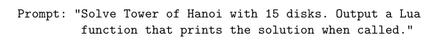
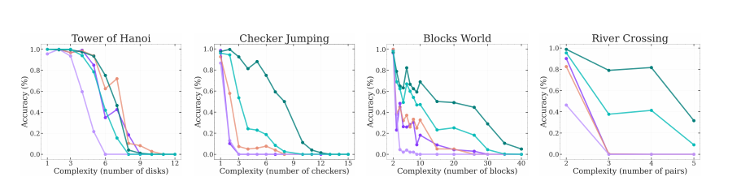

# Comment on: The Illusion of Thinking

## GPT prompts
None

## Questions

1) **What did the authors try to accomplish?**  

Explain what the authors of the original paper missed and why it explains some of their findings, debunking their findings. Although more data is needed on this ( more than one experiment).    

2) **What were key elements of the approach?**  
 

3) **What can you use for yourself?**  
- always be critical of research and do not default to assuming that the paper is right, because well they probably knew what they were doing and it got published + peer reviewed :worried:

4) **What other references can you follow?**  
None

## Handwritten notes

**Findings** of the original paper and problems:  

1) **RLMs use more tokens with increased complexity up to a complexity threshold where they start to use less**
- could be explained by the fact that they recognize when they approach token limits:  
@scaling01 found that claude sonnet outputs: "[...] The pattern continues, but to avoid making this too long I'll stop here [...]"  
- https://x.com/scaling01/status/1931817022926839909  
- however he did it only for **one sample** 
- => the automatic evaluation of the original paper probably did not distinguish between "can't solve" and "can solve but won't elaborate further because it's too long"  

2) **At some level of complexity the LRMs and LLMs crash out to near-zero accuracy**
- the above can impact accuracy  
- plus there were impossible to solve puzzles, which were evaluated as negative instances :/  
- Further anthropic authors argue that for the tower of hanoi to output all in between reasoning steps the model needs to output ~64k tokens (for claude sonnet). Given the token constraints that limits the LRM to solve only problems up to complexity of 7-8 disks (because it lacks enough tokens for more complex problems)  
- Therefore the accuracy crash out could be just due to the fact that the LLM has not enough tokens  

3) **RLMs can not solve too complex problems / don't generalize**
- the antropic authors just changed the prompt o output an algorithm which should solve the puzzle: resulting in very high accuracy in o3, claude, deepseek with only 5k tokens for N=15 (**would love to see the numbers and what "very high" accuracy means**)  

4) **Controlled complexity environment - LRMs fail to complete "easy" puzzle complexity like N=5 River Crossing while being able to solve larger N for tower of hanoi**  
- they argue that the authors have their definition of complexity "wrong": tower of hanoi has a trivial decsion process (branching = 1) while River Crossing is has a far more complex decision process and hence just increasing the complexity by f.e. increasing disks is the way
- tower of hanoi problems up to 100+ moves are easier to decide than 5+ River crossing moves  
- => solution length poorly predicts problem complexity  

### Conclusion
I think the arguments the anthopic authors bring are strong and devalue some of the findings of the original paper. However, I think there are still some valuable insights, for example I am still puzzled as to why the LRM could not perform better when given the algorithm to solve the problem. 