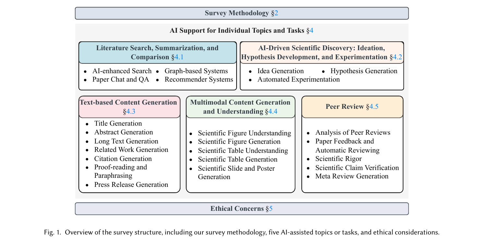
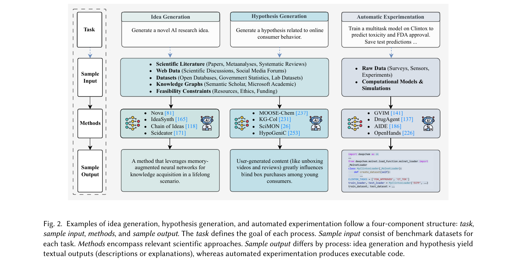
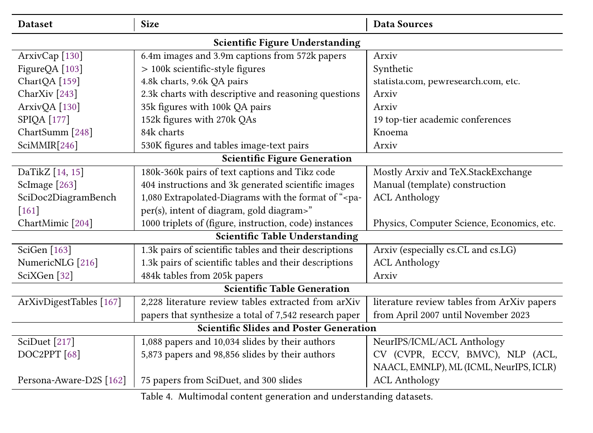

# Transforming Science with LArge Language Models: A Survey on AI-assisted Scientific Discovery, Experimentation, Contetn Generation, and Evaluation

## Introduction

### Science Lifecycle
(1) Conception Research question 
(2) Study of existing literature 
(3) Formulation falsifiable hypothesis 
(4) Design & Execution of Experiments to test the hypothesis 
(5) Analysis and Interpretation of resulting data 
(6) Report findings 

### Adresses 5 central aspects
(1) search and content **summarization**  
(2) scientific experimentation and **research idea
generation**  
(3) unimodal **content generation**, such as drafting titles, abstracts, suggesting citations, and assisting in text refinement  
(4) **multimodal content generation**, including the creation and interpretation of
figures, tables, slides, and posters  
(5) AI-assisted **peer review** processes

### Ethical concerns
(i) **hallucinating** and fabricating content  
(ii) exhibiting **bias**  
(iii) having limited reasoning abilities  
(iv) lacking proper **evaluation** mechanisms  
(v) posing significant **environmental costs**  

### Summary

## 3.1 Literature Search, Summarization, and Comparison

### AI enhanced Search
- OpenScholar
- use NLP and ML to extract key insights

### Graph-based Systems
- Sci2
- leverage a graph (structured data)
- use RAG

### Paper Chat and QA
- ChatGPT, NotebookLM
- use RAG to work on documents uploaded:
    - divide document in sections
    - embed each into vector representations
    - based on representations choose which sections should be fed to LLM
    - feed sections as context to LLM
    - improved accuracy, less halluzination, LLM relies less on training-knowlegde

### Recommender Systems
- use either collaborative filtering or content-based filtering
- Content-based methods [4, 16] analyze the text of papers to build representations that capture their meaning (TF-IDF, Embedding models).
- Collaborative filtering [12, 236] relies on user interactions, such as downloads, bookmarks, and citations, to recommend papers based on the behavior of similar users.
    - problem: cold start => use hybrid approach

### Ethical Concerns
- Mathew Effect: AI tools prefer research of popular researchers (since there is likely more data) => developing a bias
- should recommend paper based on content rather than popularity

## 3.2 AI-Driven Scientific Discovery: Ideation, Hypothesis Generation, and Experimentation

 Regarding long context input, Chai et al. [26] focus on the efficient use of limited context size of LLMs. They
introduce a selection mechanism that extracts important and relevant information from the literature and takes them as
input for LLMs to generate hypotheses. Their results show that filtering out unnecessary information helps improve the
quality of generated hypotheses.

### Hypothesis generation
- refinement strategies:
    - few-shot
    - fine tuning
    - iterative refinement (AIScientist epmloys a "generate-debate-evolve framework)

### Evaluation
- ground truth (gold hypothesis) available: metrics such as BLEU
- evaluate hypotheses based on four scientific
aspects: (a) novelty, (b) relevance to the given background, (c) significance within the research community, and (d)
verifiability, i.e., testability. 
- if not available then  a generated hypothesis or idea is
typically assessed by human experts, who compare it with the given research question and provide feedback

### Ethical Concerns
- again the AI might have a bias towards reinforcing established research paradigms
- AI-generated hypotheses may lack transparency
- insufficient ethical oversight and inadequate safety controls

## 3.3 Text-based Content Generation

- Title Generation
    - one approach is to generate a title from the abstract 
- Asbtract Generation
    - quality of ai-abstracts usually less than human drafted
- Long Text Generation
    - AI Scientist, LongWriter, LongEval
    - AI Scientist can assist at every step of research & draft whole papers though coherence and narratives are a challenge over long text
    - LongWriter adresses coherence challenges in long texts by using hierarchical attention mechanism
- Related Work Generation
    - ...
- Citation Generation
    - most citations generated are hallucinated, not reliable
- Proof Reading and Paraphrasing
    - useful writing assitant, improving style or proof-reading
    - high plagiarism rate

### Ethical Concerns
- Plagiarism
- Papers in the same domain, all using AI-assisted writing, could look very similar in structure and text

## Multimodal Content Generation and Understanding

### Scientific Figure Understanding
- datasets usually are composed of QA pairs
- many datasets available

### Scientific Figure Generation
- usually figure description or title and code pairs

### Scientific Table Understanding
...

## 3.5 Peer Review
- process: author submits a manusript, peers review it and give feedback, author adresses feedback, meta.reviewer looks at whole process and gives a final decision
- considered challenging and subjective: prone to sexism, bias, racism
- exploding submission pose a challenge on peer-review
- => need for an AI solution
- peer review data is scarce since most peer review processes are closed

application domains:
(1) Analysis of Peer Reviews
-  think of politeness, uncertainty etc.

(2) Paper Feedback and Automatic Reviewing
- knowledge graphs for explanability
- GPT4 as assistant for peer review

(3) Scientific Rigor
- systems developed to find errors in papers
- drafting weakness reports

(4) Scientific Claim Verification

(5) Meta Review Generation
